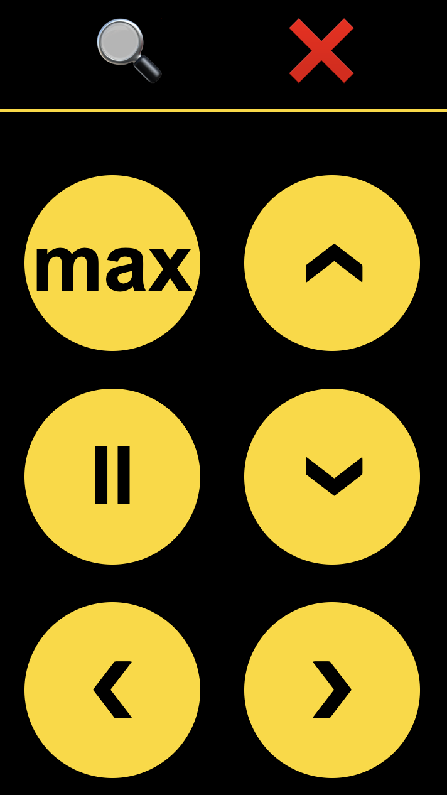

# MacRemote - control your Mac from your phone

- Simple CLI app for controlling your Mac with your phone.
- Ideal for connecting your laptop to your TV, and then opening the URL on your phone to send commands to it.
- Consists of a web server running on your laptop, which will make a Web UI accessible on the laptop's local IP address, to be able to access it e.g. on your phone connected to the same network.
- Written in Rust for performance and low RAM usage (just a few MBs).



Current functionality is mostly focused on media controls:

- Open: triggers `CMD+DOWN` for opening a file
- Close: triggers `CMD+Q` for closing a media player
- MX: triggers `F` to maximize a video
- II: triggers `SPACE` to play/pause a video
- Arrows Up/Down: trigger arrows, usually to control volume
- Arrows Left/Right: trigger arrows, usually to seek backwards and forwards

## Run locally

To run the server:

1. Build the server: `cargo build --release`
2. Run the binary: `./target/release/macremote`
3. You can also direct the logs to a file, by adding `> debug.log` after it.
4. The server should now be running on port `8000`, with the UI accessible on:
    - [http://127.0.0.1:8000](http://127.0.0.1:8000)
    - [http://0.0.0.0:8000](http://0.0.0.0:8000)
    - The laptop's local IP address (in MacOS, run `ifconfig 'en0' | grep 'inet '`) + the port.
5. If you want to make this IP stable, you should configure your router to assign
   a stable IP address to the device the MacRemote server is running on. Then you can bookmark it on your phone for easy access.

## Create a launch script

The easiest way to launch MacRemote is via a simple bash script, from anywhere in terminal:

1. Create a new file, which you can name `macremote`:
    ```sh
    #!/bin/bash
    echo "Access MacRemote on http://$(ifconfig 'en0' | grep 'inet ' | sed 's/^.*inet \([0-9\.]*\) .*/\1/'):8000"
    ABSOLUTE_PATH_TO_PROJECT/target/release/macremote > ABSOLUTE_PATH_TO_LOG_DIR/debug.log
    ```

    (replace `ABSOLUTE_PATH_TO_PROJECT` with path where you cloned this repository)
2. Make the script executable: `chmod +x macremote`
3. The folder the script is in should be added to the `PATH` environment variable for easy execution from anywhere in a terminal, with just `macremote`


